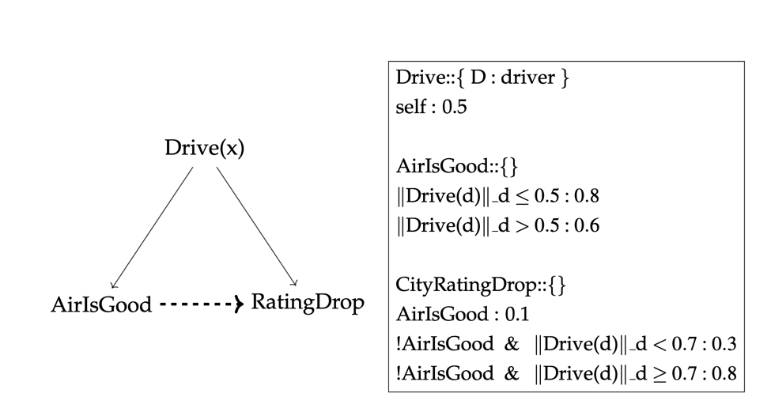

# Lifted Bayesian Networks In Conditional Probability Logic
## Project Introduction:
This project is based on article: [Conditional probability logic, lifted Bayesian networks, and almost sure quantifier elimination](https://www.sciencedirect.com/science/article/pii/S0304397520304461) by Vera Koponen
and Paper:[Statistical Relational Artificial Intelligence with Relative Frequencies: A Contribution to Modelling and Transfer Learning across Domain Sizes](https://epub.ub.uni-muenchen.de/76444/) by Dr.Weitkämper.

LBN-CPL introduces relative frequencies into statistical relational artificial intelligence, and making Halpern III-type probabilities available. This project focuses on developing a program for LBN-CPL and proposes two approaches to improve the efficiency of network building and inference in some special cases

## Project requirements
[Python](https://www.python.org/downloads/) 3.7 is required to run this project

### Suggestion: using conda env

Install Anacoda on [Linux](https://docs.anaconda.com/anaconda/install/linux/)\

Install Anaconda on [MacOS](https://docs.anaconda.com/anaconda/install/mac-os/)
Create a virtual Environmet via Anaconda\
`conda create -n yourenvname python=3.7 anaconda`
Activate your Environment\
`source activate yourenvname`
Install the all needed dependencies\
`pip install -r requirements.txt`

------

## Syntax

### Domain

A domain file contains all the finite variable domain information about a Lifted Bayesian Network, with each line of data corresponding to a variable's domain. Each line is in the format of a `<DomainVariableName> : <DomainValue>` pair, distinguished by the ":" symbol. 

Note that the names of the elements of D do not matter; all relevant information lies in the cardinalities of the sorts of D. The individual name doesn't make sense when the domain is large enough. The meaning of "lifted" actually does not care about the individual case.

Domain value in our program is of the type Integer, which is common with a huge domain. In the example of an infectious disease, the node `Is_infectious` has the variable domain x, and x represents the people. For example, domain data is "people: 100" means the domain of people is 100, $\vec{x}$ is the tuple of x1, x2,...x100.

### Formula

A formula file consists of each node including its formula. The format for each node is as follows:

$$NodeName::\{Parameter\ :\ DomainVariableName,... \}$$
$$CPLFormulas\ :\ Probability$$

Between 2 node formulas, there is a blank line for separation. 

#### NodeName

Throughout, a name is an alphanumeric string using Upper-Camel-Case and generally without any special symbols. For instance, "Is_infectious" should be "IsInfectious". The only case using underscores is '_' to represent the individual in the domain, e.g. "IsInfectious_x_1" means the first person in the domain of people x.

#### CPLFormulas

CPLFormulas are composed of n number of conditional probability formula(s), n ∈ ℕ⁰. Let ϕ and ϕ̂ be 2 conditional probability formulas. The syntax of logic symbols in the program is as follows:

- Relative frequency of the form: $$\|\phi(x) \ \mid\  \varphi(x,y)\|\_x$$
- a negation of the form:$$ !\phi(x)$$
- a conjunction of the form is divided into two situations(attention: a space interval), that is more convenience to parse the formula:
  -  In frequency area: $$\|\phi(x)\  \ AND \ \  \varphi(x,y)\|\_x $$
  -  In normal: $$\phi(x)\  \And\  \varphi(y)$$
- a disjunction of the form(attention: a space interval), avoid using $"\mid"$ to confuse frequency symbol and conditional symbol, is also divided into two situations:
  - In frequency area: $$\|\phi(x) \ \  OR \ \  \varphi(x,y)\|\_x $$
  - In normal: $$\phi(x)\ \  or\  \ \varphi(y)$$
- the implies of the form: $\phi \to \varphi$ not be used instead of applying the following form to represent the implied meaning 
  - $$ !\phi\  or\  \varphi$$
- universal quantification of the form (relative frequency can seem quantifier-free): 
  - Applying frequency is 1 to represent FORALL: $$\|\phi(x) \|\_x == 1$$
- existential quantification of the form:
  - Applying frequency `> 0` to represent EXIST: $$\|\phi(x) \|\_x\  \> 0$$

Additionally, for a root node, using the form as $$\textbf{self} :\   Probability $$ that means the node in domain D with the uniform distribution with a given probability. In our program, the root node must simply be an independent Bernoulli trial (some percentage true, some percentage false), because it does not depend on anything else for its probability. 

### LBN-CPL Example: Drive Model
We assume the City Rating dropping depends on 2 factors: the frequency
of drivers driving on the road and the air quality. For each driver in the city
of Shanghai, the probability of he/she driving on the road is 50%, When the
frequency of drives is less than half, i.e. the number of drives for all drives in
the city is less than half, the probability of good air quality is 80%; otherwise,
is 60% (The negative impact of vehicle gas pollution on air quality). If the
air quality is good, the City rating is hard to drop(10%); if the air is not
good and the frequency of drivers driving on the road is less than 70%, the
city rating has slightly possible to drop(30%); if the air is not good and the
frequency of drivers more than 70%, the rating will drop very likely (80%)

