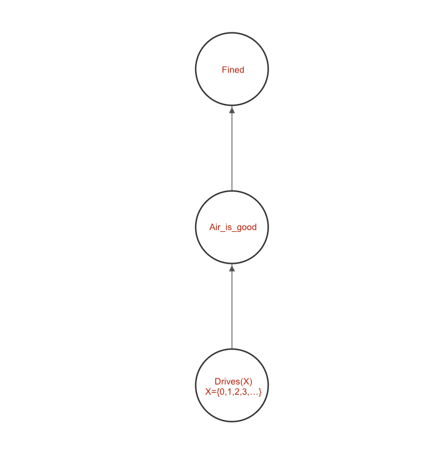

# Lifted Bayesian Networks In Conditional Probability Logic
## Project Introduction:
This project is based on Paper:[Statistical Relational Artificial Intelligence with Relative Frequencies: A Contribution to Modelling and Transfer Learning across Domain Sizes](https://epub.ub.uni-muenchen.de/76444/) by Dr.Felix Weitkämper.

 Currently is mainly a typical LBN-CPL example.
### Example Description:
A very simple example in LBN-CPL is:
The likelihood of a driver being fined depends on two factors:
the air quality and the  frequency of people driving:
* For every person, the probability of he drives is 50%
* When the frequence of drives less than a half, i.e. the number of drives people is less than a half, the probability of good air is 80%;otherwise, is 60%
* If the air is good, the driver will hardly be fined(10%); if the air is not good and the frequency of drivers less than 70%, the driver will slightly be fined(30%); if the air is not good and the frequency of drivers more than 70%, the driver will be fined be fined Very likely (80%)

#### Domain:
this example will be in the specify domain, for example:

``Domain: {Paul, James, Alice,...}``

#### GAP:

* **Q:**
    1. 0.8 0.6 is that not probability? is likelihood?
    2. is the frequency meaning right?
    3. Fined or Fined(X) ???

### Task :
1.
## Project requirements

[Python](https://www.python.org/downloads/) 3.7 is required to run this project
### Suggestion: using conda env
Install Anacoda on [Linux](https://docs.anaconda.com/anaconda/install/linux/)\
Install Anaconda on [MacOS](https://docs.anaconda.com/anaconda/install/mac-os/)

Create a virtual Environmet via Anaconda\
`conda create -n yourenvname python=3.7 anaconda`

Activate your Environment\
`source activate yourenvname`

Install the all needed dependencies\
`pip install -r requirements.txt`

